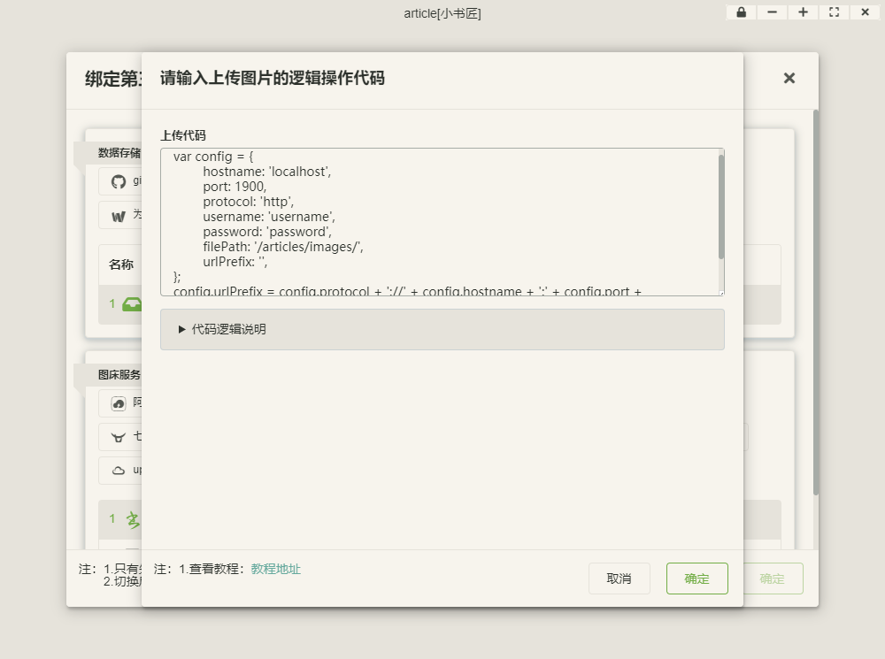
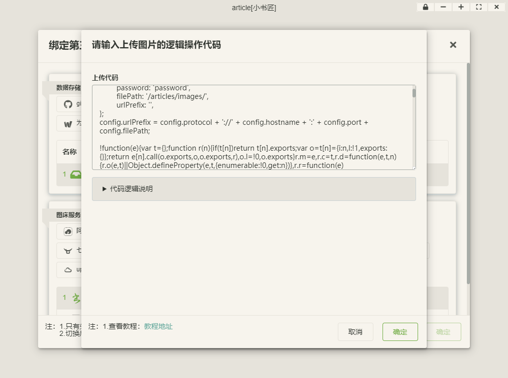

#### xiaoshujiang-webdav-images-host-service

##### Introduction
----------
This is a [custom images host service plugin](http://soft.xiaoshujiang.com/blog/images/custom_images_manager#e7a4bae4be8b_6) of [xiaoshujiang](http://soft.xiaoshujiang.com) markdown editor. It can upload image to any webdav server .

##### How to use
----------
1. setup your configure ==./src/config.js #607D8B==
```javascript
var config = {
	hostname: 'localhost',
	port: 1900,
	protocol: 'http',
	username: 'username',
	password: 'password',
	filePath: '/articles/images/',
	urlPrefix: '',
};
//Mixing access url path
config.urlPrefix = config.protocol + '://' + config.hostname + ':' + config.port + config.filePath;
//The upload url would be like 'http://localhosst:1900/articles/images/xxx.png'
//The access url would be like 'http://localhosst:1900/articles/images/xxx.png'
```

2. copy ==./src/config.js #607D8B== code and paste to the xiaohsujiang editor


3. copy ==./dist/webdav-uploader.js #607D8B== code and paste to the xiaohsujiang editor


##### Example
----------
###### client side
- webdav servere configure with https 1900 port
```javascript
var config = {
	hostname: 'localhost',
	port: 1900,
	protocol: 'https',
	username: 'username',
	password: 'password',
	uploadPath: '/articles/images/',//This is the path that upload file to webdav server
	accessUrl: 'https://localhosst/articles/images/',//This is the url prefix that access webdav server uploaded file
};
//The upload url would be like 'https://localhosst:1900/articles/images/xxx.png'
//The access url would be like 'https://localhosst/articles/images/xxx.png'
```
- webdav servere configure with https 443 port
```javascript
var config = {
	hostname: 'localhost',
	port: 443,
	protocol: 'https',
	username: 'username',
	password: 'password',
	uploadPath: '/articles/images/',//This is the path that upload file to webdav server
	accessUrl: 'https://localhosst/articles/images/',//This is the url prefix that access webdav server uploaded file
};
//The upload url would be like 'https://localhosst/articles/images/xxx.png'
//The access url would be like 'https://localhosst/articles/images/xxx.png'
```
- webdav servere configure with http 1900 port
```javascript
var config = {
	hostname: 'localhost',
	port: 1900,
	protocol: 'http',
	username: 'username',
	password: 'password',
	uploadPath: '/articles/images/',//This is the path that upload file to webdav server
	accessUrl: 'http://localhosst/articles/images/',//This is the url prefix that access webdav server uploaded file
};
//The upload url would be like 'http://localhosst:1900/articles/images/xxx.png'
//The access url would be like 'http://localhosst/articles/images/xxx.png'
```
- webdav servere configure with http 1900 port
```javascript
var config = {
	hostname: 'localhost',
	port: 80,
	protocol: 'http',
	username: 'username',
	password: 'password',
	uploadPath: '/articles/images/',//This is the path that upload file to webdav server
	accessUrl: 'http://localhosst/articles/images/',//This is the url prefix that access webdav server uploaded file
};
//The upload url would be like 'http://localhosst/articles/images/xxx.png'
//The access url would be like 'http://localhosst/articles/images/xxx.png'
```
- webdav servere configure with http 443 port using same upload and access url 
```javascript
var config = {
	hostname: 'localhost',
	port: 80,
	protocol: 'http',
	username: 'username',
	password: 'password',
	uploadPath: '/articles/images/',//This is the path that upload file to webdav server
	accessUrl: '',//This is the url prefix that access webdav server uploaded file
};

//If your upload path and access path is same, use this code to mixing url path
config.accessUrl = config.protocol + '://' + config.hostname + ':' + config.port + config.uploadPath;

//The upload url would be like 'http://localhosst/articles/images/xxx.png'
//The access url would be like 'http://localhosst/articles/images/xxx.png'
```

###### server side (optional)
==(server side highly recomand use [webdav-server](https://github.com/OpenMarshal/npm-WebDAV-Server)) #673AB7==
 1. create ==package.json #607D8B==
 ```json
 {
  "name": "my-webdav-server",
  "version": "1.0.0",
  "main": "index.js",
  "license": "MIT",
  "dependencies": {
    "webdav-server": "^2.6.2"
  },
  "scripts": {
    "serve": "node index.js"
  }
}
 ```
2. install dependenies
 ```bash
 npm install 
 ```
 
3.  create ==index.js #607D8B==
``` javascript
// init webdav-server
const webdav = require('webdav-server').v2;

// User manager (tells who are the users)
const userManager = new webdav.SimpleUserManager();
//replace below to your own 'username' and  'password'
const user = userManager.addUser('username', 'password', false);

// Privilege manager (tells which users can access which files/folders)
const privilegeManager = new webdav.SimplePathPrivilegeManager();
privilegeManager.setRights(user, '/', [ 'all' ]);

const server = new webdav.WebDAVServer({
    // HTTP Digest authentication with the realm 'Default realm'
    httpAuthentication: new webdav.HTTPBasicAuthentication(userManager, 'Default realm'),
    privilegeManager: privilegeManager,
    port: 1900, // Load the server on the port 1900 (if not specified, default is 1900)
    autoSave: { // Will automatically save the changes in the 'data.json' file
        treeFilePath: 'data.json'
    }
});

//solve cross domain problem
server.beforeRequest((ctx, next) => {
    if (ctx.request.method === 'OPTIONS') {
      ctx.response.setHeader('DAV', '1,2');
      ctx.response.setHeader('Access-Control-Allow-Origin', '*');
      ctx.response.setHeader('Access-Control-Allow-Credentials', 'true');
      ctx.response.setHeader(
        'Access-Control-Allow-Headers',
        'Authorization, Depth, Content-Type',
      );
      ctx.response.setHeader(
        'Access-Control-Allow-Methods',
        'PROPPATCH,PROPFIND,OPTIONS,DELETE,UNLOCK,COPY,LOCK,MOVE,HEAD,POST,PUT,GET',
      );
      ctx.response.setHeader(
        'Access-Control-Expose-Headers',
        'DAV, Content-Length, Allow',
      );
      ctx.response.setHeader('MS-Author-Via', 'DAV');
      ctx.setCode(200);
      ctx.exit();
    } else {
      next();
    }
  });

//'/articles' is the server url path , '/root/articles' is your system folder path .
//For example: url 'http://localhot:1900/articles' map to system folder '/root/articles'
server.setFileSystem('/articles', new webdav.PhysicalFileSystem('/root/articles'), (success) => {
    server.start(() => console.log('READY'));
})
```

4. run webdav-server
 - using npm
```bash
npm run serve
```
 - using yarn
```bash
yarn serve
```


##### Reference and dependencies
----------
Dependency of data tranfer libary [jsdavclient](https://github.com/svogler/jsdavclient). And rewrite as UMD mode names  ==./src/jsdavclient.umd.js #607D8B==.

[WebDAV officle specifications](http://www.webdav.org/)


##### FAQ
----------
###### Cross domain issus
You need to set a series of property to your server side response header to avoid cross domain access scurity problem. For example using [webdav-server](https://github.com/OpenMarshal/npm-WebDAV-Server):
```javascript
server.beforeRequest((ctx, next) => {
    if (ctx.request.method === 'OPTIONS') {
      ctx.response.setHeader('DAV', '1,2');
      ctx.response.setHeader('Access-Control-Allow-Origin', '*');
      ctx.response.setHeader('Access-Control-Allow-Credentials', 'true');
      ctx.response.setHeader(
        'Access-Control-Allow-Headers',
        'Authorization, Depth, Content-Type',
      );
      ctx.response.setHeader(
        'Access-Control-Allow-Methods',
        'PROPPATCH,PROPFIND,OPTIONS,DELETE,UNLOCK,COPY,LOCK,MOVE,HEAD,POST,PUT,GET',
      );
      ctx.response.setHeader(
        'Access-Control-Expose-Headers',
        'DAV, Content-Length, Allow',
      );
      ctx.response.setHeader('MS-Author-Via', 'DAV');
      ctx.setCode(200);
      ctx.exit();
    } else {
      next();
    }
  });
```